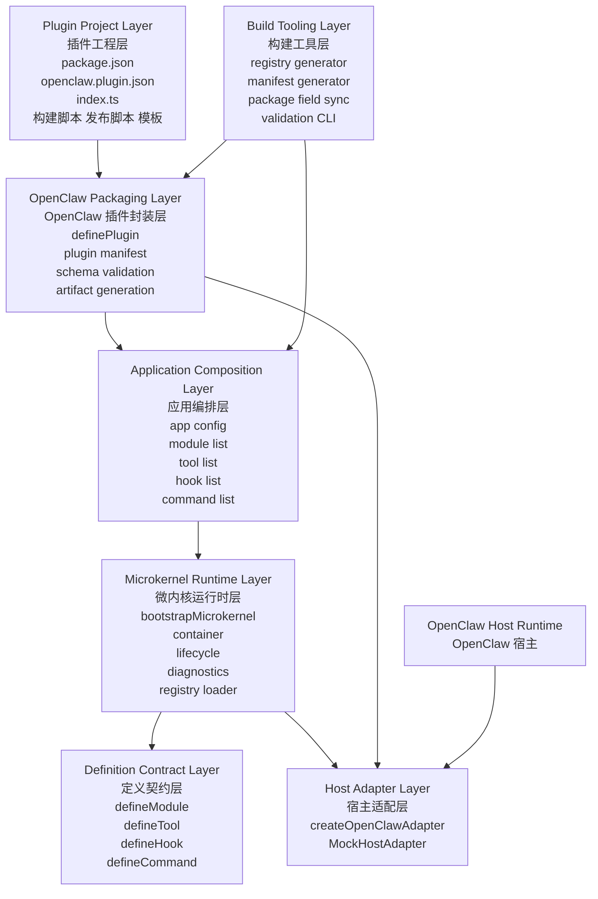
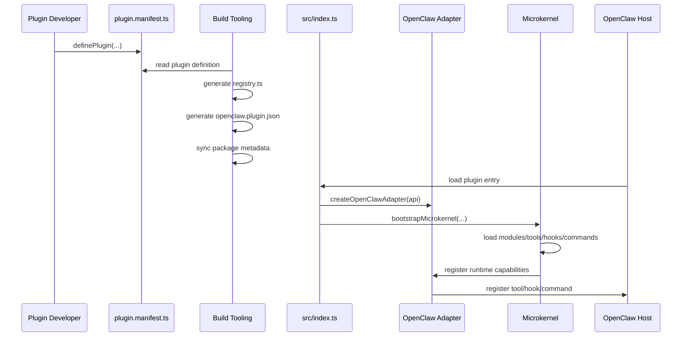

# 完整 OpenClaw 插件框架升级分层设计图

本文档回答一个关键架构问题：

`当前的约定式微内核原型，如何升级为一个可发布、可安装、可被 OpenClaw 正式识别的完整插件框架。`

结论先行：

`不要把 OpenClaw 插件三件套硬塞进微内核内部，而要在微内核之上增加一个“插件封装层”和“插件工程层”，形成清晰分层。`

---

## 1. 总体分层图



---

## 2. 一句话解释每一层

### 2.1 Plugin Project Layer

这一层是开发者真正看到的插件工程外观。

它负责：

- npm 包结构
- OpenClaw 插件清单文件
- 入口文件暴露
- 构建、测试、发布脚本
- 工程模板与脚手架体验

这一层对应你看到的完整插件三件套：

- `package.json`
- `openclaw.plugin.json`
- `index.ts`

这层必须存在，因为这是插件交付给宿主和生态时的外部契约。

### 2.2 OpenClaw Packaging Layer

这一层是整个升级方案里最关键、也是当前仓库还缺失的一层。

它负责把“插件工程的宿主契约”映射到“框架运行时契约”。

它应该提供：

- `definePlugin()` 作为单一真相入口
- 插件 ID、名称、版本、描述、能力声明
- 配置 schema
- OpenClaw 元数据
- 产物生成能力
- Manifest 校验能力

这一层不直接负责模块生命周期，但它决定一个插件能不能被真实宿主识别、安装、加载。

### 2.3 Application Composition Layer

这一层负责表达“一个插件应用由哪些能力单元组成”。

它负责：

- app 级配置
- 选择哪些 module/tool/hook/command 进入插件
- 组合多个领域模块
- 定义默认配置与环境配置来源

你当前的 `src/generated/registry.ts` 和 `src/example-app/bootstrap.ts`，本质上已经处于这一层与微内核之间。

### 2.4 Microkernel Runtime Layer

这一层是当前仓库已经做得比较正确的部分。

它负责：

- 生命周期编排
- 容器管理
- 模块依赖排序
- tool/hook/command 注册
- 启动诊断与关闭顺序

对应当前实现：

- `src/framework/core/kernel.ts`
- `src/framework/core/container.ts`
- `src/framework/core/types.ts`
- `src/framework/core/registry.ts`
- `src/framework/core/logger.ts`

### 2.5 Definition Contract Layer

这一层定义最小能力单元契约。

对应当前实现：

- `defineModule()`
- `defineTool()`
- `defineHook()`
- `defineCommand()`

这是整个系统的“插件内部语言”。

### 2.6 Host Adapter Layer

这一层把框架运行时映射到真实宿主 API。

它负责：

- 把 `ToolDefinition` 映射成 OpenClaw tool 注册形式
- 把 `HookDefinition` 映射成宿主事件监听
- 把 `CommandDefinition` 映射成 CLI 能力
- 隔离宿主差异

对应当前实现：

- `src/framework/openclaw/adapter.ts`
- `src/example-app/mock-host.ts`

### 2.7 Build Tooling Layer

这一层用于把“开发体验”变成“稳定产物”。

它负责：

- 扫描并生成 registry
- 生成 `openclaw.plugin.json`
- 同步 `package.json` 的关键字段
- 校验 schema
- 输出构建诊断

这一层决定框架是否能真正产品化，而不是停留在原型阶段。

---

## 3. 升级后应该形成的文件结构

建议目标结构如下：

```text
my-plugin/
  package.json
  openclaw.plugin.json
  tsconfig.json
  src/
    index.ts
    plugin.manifest.ts
    app/
      modules/
      tools/
      hooks/
      commands/
    generated/
      registry.ts
      plugin-meta.ts
  scripts/
    generate-registry.mjs
    generate-plugin-manifest.mjs
    validate-plugin.mjs
```

各文件职责如下：

- `package.json`
  npm 包信息、构建入口、版本、依赖、发布脚本。

- `openclaw.plugin.json`
  OpenClaw 识别插件所需的宿主元数据，不建议手工维护全部字段。

- `src/index.ts`
  薄入口，只负责把宿主环境接到框架上。

- `src/plugin.manifest.ts`
  框架内部唯一真相，建议由 `definePlugin()` 导出。

- `src/generated/registry.ts`
  构建期能力发现产物。

- `src/generated/plugin-meta.ts`
  由 manifest 生成的标准化插件元信息。

---

## 4. 核心设计原则

### 4.1 单一真相原则

不要让开发者在 3 个地方重复维护插件身份信息。

正确做法是：

- 开发者主要维护 `definePlugin()`
- 构建工具生成 `openclaw.plugin.json`
- 构建工具同步 `package.json` 的部分字段
- `index.ts` 只消费生成后的标准化元数据

### 4.2 内核保持宿主无关

`bootstrapMicrokernel()` 不应该依赖 `openclaw.plugin.json` 的具体字段格式。

原因是：

- 微内核应当保持抽象稳定
- 宿主协议将来可能变化
- 多宿主支持需要边界分离

所以宿主清单文件应该停留在封装层，而不是下沉到内核层。

### 4.3 入口文件必须薄

不要让 `src/index.ts` 重新变成巨型注册中心。

正确入口应类似：

```ts
import { bootstrapOpenClawPlugin } from "./runtime/bootstrap-openclaw-plugin";
import manifest from "./plugin.manifest";

export default bootstrapOpenClawPlugin(manifest);
```

入口只做桥接，不做业务编排。

### 4.4 构建期生成优先于运行时扫描

当前仓库这一点是正确的，应该继续坚持。

未来不只要生成 registry，还要生成：

- 插件 manifest 产物
- schema 校验报告
- package metadata 同步结果

---

## 5. definePlugin 的建议模型

建议新增统一插件定义函数：

```ts
export default definePlugin({
  id: "memory-plugin",
  name: "Memory Plugin",
  version: "0.1.0",
  description: "OpenClaw memory capability plugin",
  openclaw: {
    runtime: "node",
    entry: "dist/index.js",
  },
  configSchema: {
    type: "object",
    properties: {
      namespace: { type: "string" }
    }
  },
  app: {
    root: "src/app",
  },
});
```

它至少应该包含这几类信息：

- 身份信息：`id` `name` `version` `description`
- 宿主信息：OpenClaw 所需元数据
- 配置信息：schema、默认值、环境绑定策略
- 应用信息：app root、registry 来源、能力声明
- 构建信息：入口、输出目录、生成策略

---

## 6. 运行链路设计图



---

## 7. 当前仓库与目标架构的映射关系

### 当前已经具备的部分

- 能力单元契约已存在
- 微内核生命周期已存在
- 宿主适配器边界已存在
- 构建期 registry 生成思想已存在

### 当前缺失的关键部分

- 插件级 manifest 抽象
- `openclaw.plugin.json` 生成能力
- `package.json` 与插件信息的同步策略
- 标准化的真实插件入口
- 插件工程模板层
- manifest 校验和错误报告

### 这意味着什么

这说明当前仓库不是错了，而是少了一层。

更准确地说：

`你已经做出了“插件运行时底座”，但还没有做出“完整插件产品壳”。`

---

## 8. 推荐的升级顺序

### Phase 1: 建立插件定义层

新增：

- `definePlugin()`
- `PluginManifest` 类型
- `plugin.manifest.ts`

目标：

让插件身份、OpenClaw 元数据、配置 schema 有统一来源。

### Phase 2: 建立 manifest 生成层

新增：

- `generate-plugin-manifest.mjs`
- `validate-plugin.mjs`
- `src/generated/plugin-meta.ts`

目标：

自动生成 `openclaw.plugin.json`，并做字段校验。

### Phase 3: 建立薄入口层

新增：

- `src/index.ts`
- `bootstrapOpenClawPlugin()`

目标：

把真实宿主加载入口标准化。

### Phase 4: 工程模板化

新增：

- plugin starter template
- create-plugin scaffolder
- 文档与示例工程

目标：

把框架从“能用”升级到“可复制”。

### Phase 5: 产品化治理

新增：

- schema 版本控制
- capability 声明
- 插件兼容性校验
- CI 校验命令

目标：

让插件生态长期可演化。

---

## 9. 最终目标架构判断

一个完整的 OpenClaw 插件框架，不应只有微内核。

它应该同时满足 3 件事：

1. `宿主可识别`
2. `框架可启动`
3. `插件可工程化发布`

所以最终正确公式是：

`完整 OpenClaw 插件框架 = 微内核运行时 + OpenClaw 插件封装层 + 插件工程层 + 构建工具层`

不是单独哪一层替代另一层。

---

## 10. 最终建议

如果你把这个仓库作为未来 OpenClaw 插件底座，那么下一步最值得做的不是重写内核，而是：

1. 在内核之上补 `definePlugin()`
2. 引入 `openclaw.plugin.json` 自动生成
3. 引入标准化 `src/index.ts` 插件入口
4. 让 `package.json` 与插件 manifest 形成受控同步

这样这套框架才会从：

`OpenClaw 运行时原型`

升级为：

`OpenClaw 完整插件开发框架`
